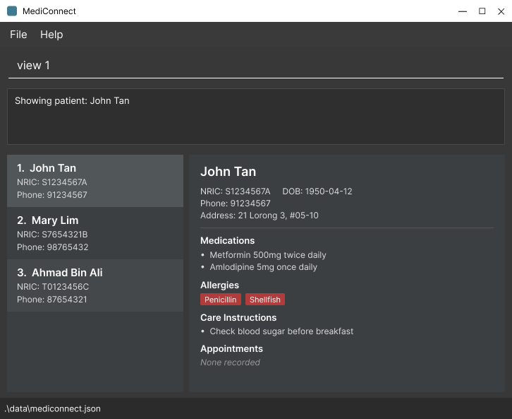

# MediConnect

MediConnect is a desktop application for clinic receptionists who manage patient contact details. It combines
fast typed commands with a graphical interface, allowing staff to update and retrieve records without navigating
through multiple screens.

MediConnect currently supports adding, editing, deleting, listing, and searching contact records. Records can also
be tagged for simple categorization.

For more information, visit the [MediConnect product website](https://ay2627s1-cs2103t-w08-1.github.io/tp/).
