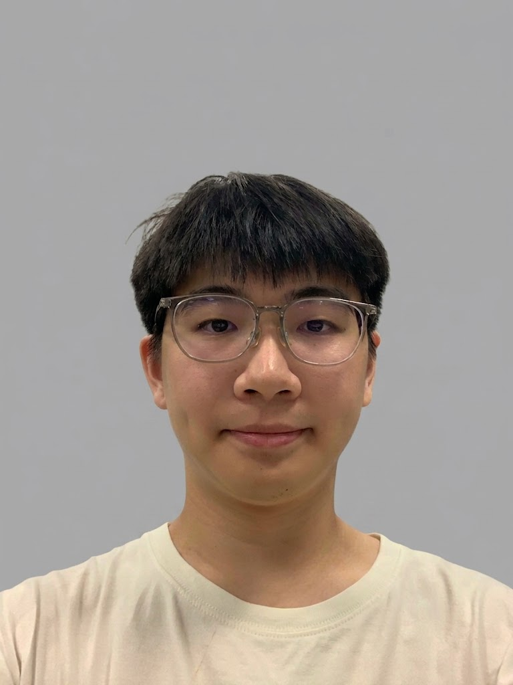
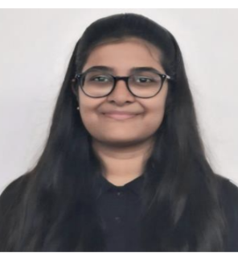
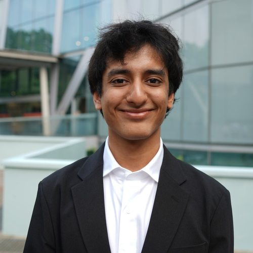

# About Us

We are a team based in the [School of Computing, National University of Singapore](http://www.comp.nus.edu.sg).

You can reach us at the email `seer[at]comp.nus.edu.sg`
You can reach our team at the email `akoromy@gmail.com`

## Project team

### Ming Xuan

[[github](https://github.com/JellehBelleh)]
[[portfolio](team/jellehbelleh.md)]

* Role: Member 

### Solomon

[[homepage](https://kohkohnut.org/)]
[[github](http://github.com/KohKoh-Nut)]

* Role: Developer
* Responsibilities: UI

### Raisa Nishat

[[github](https://github.com/nraisa0408)] 

* Role: Developer
* Responsibilities: Data

### Romy Ako

[[github](http://github.com/akoromy)]

* Role: Developer
* Responsibilities: Dev Ops + Threading

### Gauhet Poddar

[[github](https://github.com/Gauhet)]

* Role: Developer
